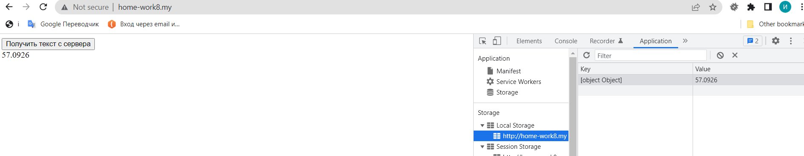
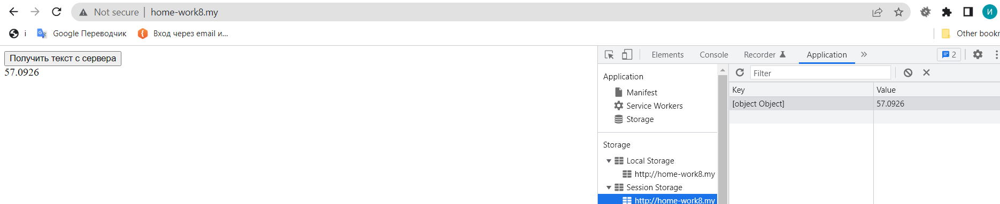
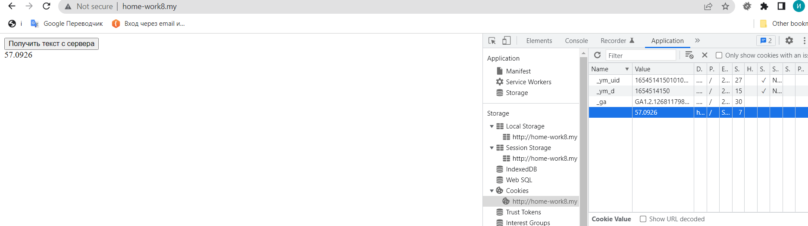

## Домашнее заданее № 8:

- Делаем на запрос на https://www.cbr-xml-daily.ru/daily_json.js и получаем стоимость доллара.
- сограняем стоимость в LocalStorage, SessionStorage и Cookie

# Домашнее задание 8. Ваша задача хранить данные на клиенте полученные асинхронным запросом с любого fake api::
#### 1. Сделайте запрос на fake api, получите и обработайте ответ. Настройку запроса на получение данных из серверов осуществить через GuzzleHttp.
#### 2. Сохранить полученные данные в одном из возможных хранилищ.
#### 3. При обновление/закрытии/открытии вкладки выводите данные в верстку если хранилище не пусто.

 
