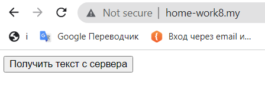
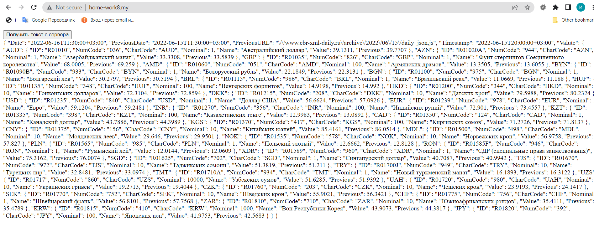

## Домашнее заданее № 8:

- На данный момент получилось после работы с Guzzle Http (не асинхронно) сохранить данные в Cookie c помощью метода setcookie в php. В данном проекте данного кода нет.
- Все что получилось, это сделать fetch JS запрос и получить текст с API ЦБ РФ https://www.cbr-xml-daily.ru/daily_json.js по нажатию на кнопку.
- 
- 
- Данный проект будет дорабатываться в соответствии с требованиями ДЗ, по мере изучения.

# Домашнее задание 8. Ваша задача хранить данные на клиенте полученные асинхронным запросом с любого fake api::
#### 1. Сделайте запрос на fake api, получите и обработайте ответ. Настройку запроса на получение данных из серверов осуществить через GuzzleHttp.
#### 2. Сохранить полученные данные в одном из возможных хранилищ.
#### 3. При обновление/закрытии/открытии вкладки выводите данные в верстку если хранилище не пусто.

 
